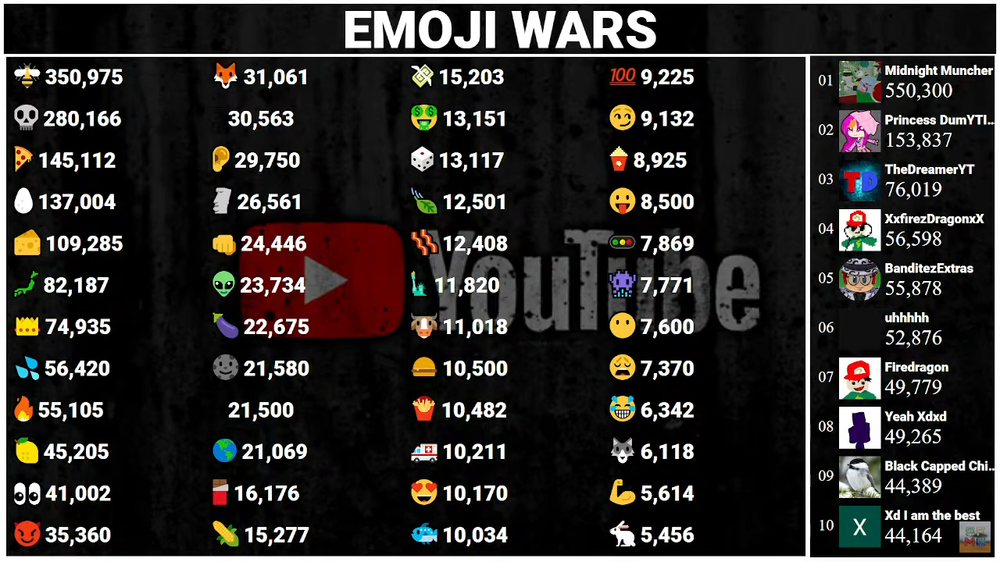

# Emoji-Wars
A Fun YT Chat Game!

  

If you use this give me credit in the description!

**Emoji Wars** Emoji Wars is a fun YouTube chat game, Idea by BattleTV and MrRanker, coding by Straight From MG
**https://youtube.com/straightfrommg**
 
**https://mgcounts.com**

## Contributing
To contribute, simply **fork the repository**, edit the things you want to and **submit a pull request**.
We will then check your pull request and accept/deny it.
If you are clueless about what you are doing, don't waste your time trying.

## How to play:
Spam emojis in the yt chat and level up!

## Setup: 
1. Download <a href="https://nodejs.org/en/download/">Node.js</a> version 18.15.0 (or later) and install it.
2. Download the <a href="https://github.com/mgcountss/Emoji-Wars/releases/tag/4.0">latest release</a> of Emoji Wars from the releases tab.
3. Extract the zip file and open it in command prompt.
4. Run `npm install` to install the required packages.
5. Open the `id.json` file and replace `{video_id}` with the video id of the stream.
6. Run `node .` to start the bot.
7. Enjoy!

## Need help? 
Email Me: **straightfrommgyt@gmail.com**
OR Join the Discord server: **https://discord.gg/UsEfksU**